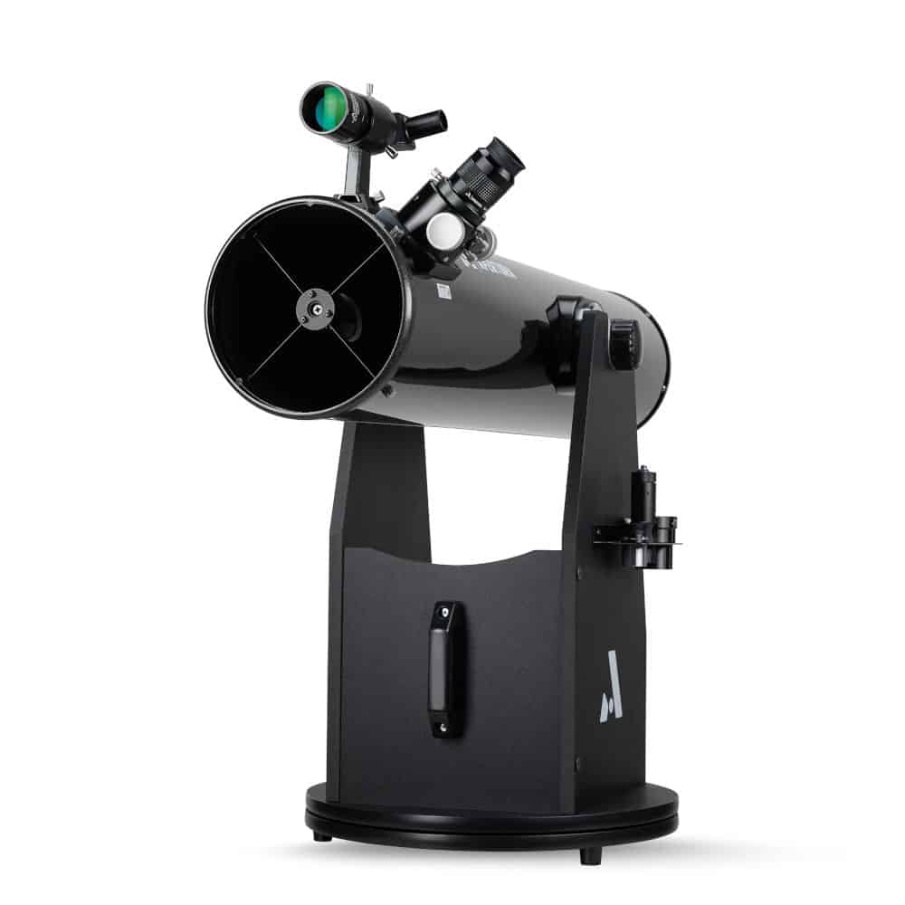

# PushTo ReadMe

PushTo synchronizes a push-to telescope with Stellarium, allowing Stellarium to act
as a high-precision finder. The goal is to achieve an overall pointing accuracy of
better than 5 arcmin.

- The telescope has a Dobsonian mount outfitted with rotary encoders on each axis
- An Arduino Uno reads the encoder data and writes it to serial at regular intervals
- The encoder data is translated to right ascension (RA) and declination (Dec)
- The translated data is written to the Stellarium Telescope Control interface

Table of contents:
- [Installation](#install)
- [Overview](#overview)
    - [Hardware](#hardware)
    - [Stellarium](#stellarium)
    - [Coordinates](#coords)
    - [User Interface](#ui)
- [Known Issues](#issues)

---

## Installation

To install everything into a virtual env:

    > virtualenv pushto
    > cd pushto
    > source bin/activate
    > pip install git+https://github.com/ptoale/pushto.git

Connect your arduino to the serial port and start Stellarium. You can then start the system
with:

    > pushto

Change the configuration to match your setup and deploy.

---

## Overview

### Hardware

The rotary sensors are incremental optical encoders with NPN open collector style output.
I choose the 600 ppr model that can be found
[here](https://www.amazon.com/dp/B07MX1SYXB?psc=1&ref=ppx_yo2ov_dt_b_product_details).
They can be read in quadrature, providing sense of rotation and 4x resolution. The encoders
themselves provide an angular resolution of 9 arcmin per count.

One encoder is attached to each mount axis using GT2 timing belts and pulleys. The azimuthal
encoder is connected to a pulley on the azimuthal bearing that provides a gear ratio of
100T to 16T, or 6.25x. The elevation encoder is connected to the altitude bearing with a 
gear ratio of 176T to 16T, or 11x. The telescope attitude therefore has a resolution of
- Theta: 49 arcsec
- Phi: 86 arcsec

The arduino sketch makes use of the [`QuadratureEncoder`](https://github.com/Saeterncj/QuadratureEncoder) 
library. The encoders are read on interrupt and the counts and error counts are made available
to the sketch. Every 50ms the sketch gets the encoder data and writes it to serial.

The `Telescope` object reads the serial port in a thread, applies a pointing model to produce
the telescope attitude, and publishes it to a [`zmq`](https://zeromq.org) `PUB` socket.

---

### Stellarium

[Stellarium](https://stellarium.org/) is an open-source planetarium application available on 
many platforms. It comes with a [Telescope Control](https://stellarium.sourceforge.net/wiki/index.php/Telescope_Control_plug-in) 
plugin that allows for simple interactions between Stellarium and a goto telescope or 
generic telescope server. In this case we configure a telescope as 'local, external' which
allows for commands to be sent and received over a configurable socket. The communications
protocol is documented [here](https://free-astro.org/images/b/b7/Stellarium_telescope_protocol.txt).

The `StellariumTC` class handles all communications with Stellarium. It receives telescope 
position data (RA, Dec) and communicates it to Stellarium using `CurrentPosition`
messages. It also listens for `Goto` messages from Stellarium, which is publishes on a `zmq` `PUB` socket.

---

### Coordinate Transformations

The telescope direction information must be transformed from encoder counts to J2000 equatorial
coordinates (RA, Dec). This is done in five steps:

1. Encoder counts to raw telescope attitude
2. Raw telescope attitude to corrected telescope attitude
3. Corrected telescope attitude to local azimuth and altitude
4. Local azimuth and altitude to equatorial right ascension and declination
5. RA and Dec to Stellarium binary format

#### Encoder counts and Telescope attitude

To get the telescope attitude from the encoder counts, we need to know the number of 
counts per revolution of the telescope axes. There are three pieces of information needed:

1. The npr of the encoders: in this case 600x4 = 2400 counts/revolution
2. The sense of rotation: is positive counts clockwise or counter-clockwise?
3. The gearing ratios, which may be different for the two axes

These data can be configured through the UI. Once angles are calculated, they are cast
as proper spherical angles: theta=[-90:+90], phi=[0,360]. This angles can then by corrected
by applying a pre-determined pointing model to account for mount errors.

#### Aligning the Telescope

The encoders start at (0, 0) when the arduino is powered on. Ideally, this would correspond
to a local azimuth of 0 and local altitude of 0. We can get close by attempting to aim the
telescope due north on the horizon before turning on the arduino, but we can align the telescope
no matter its initial direction by using data from Stellarium. The procedure is:

1. Find a star that is visible
2. Select the star within Stellarium
3. Center the star in the telescope eyepiece
4. Click `Current Object` button in the Telescope Control pane and then click `Slew`
5. Repeat for at least one more star

This process stores pairs of coordinates for a fixed direction:

1. Telescope phi and theta
2. Local azimuth and altitude translated from Stellarium RA and Dec

This data is used to work out the rotation matrix connecting the telescope directions to 
the local horizontal coordinates.

#### Local Horizontal and Equatorial Coordinates

The translation between equatorial and local horizontal depends on location and time.
The [astropy](https://www.astropy.org/) package is used to handle this transformation.
It's ICRS frame should match Stellarium J2000 data at the level of precision needed. Also,
it's atmospheric refraction model seems to match Stellarium's calculation.

---

### User Interface

The user interface allows for easy configuration of all relevant parameters, deploying the
application, and terminating the application. To start it:

        > pushto

        ************************************************
        **                PushTo v1.0                 **
        **                                            **
        ** UTC: 2022-11-13 14:01:06.996               **
        ************************************************
    
        ** Main Menu:
    
        ** 1. Configure
        ** 2. Deploy
        ** 3. Reset Alignment
        ** 4. Quit
    
        ** Enter menu number: 

---

## Known Issues

### Encoders and Gearing

- The azimuthal encoder should count 4x600x100/16=15000 for a 360&deg; rotation. It doesn't,
instead it's about 15507 counts. This was found by sighting the screw on a door knob through
the view finder and rotating the telescope 360&deg;. This difference amounts to a 12&deg;
error. At this point, I don't know if the error is in the encoder, the pulleys, or the homemade
belt, but it does seem to be a stable error.

- The altitude encoder should count 600x176/16=6600 for a 90&deg; rotation. Instead, the
count is around 6799. This results in a 3&deg; error. I'm concerned that the error in the
altitude angle is not stable. I will check the pulley and belt. Need a clear night to check
both angles against known positions of stars.

### Stellarium and Astropy

- Stellarium:

    - Uses J2000 by default. These are the only coordinates passed through the Telescope
Control interface. The Remote Control api allows for additional information to be gathered,
such as UTC and horizontal coordinates. Stellarium should be configured with the current location
and time.

    - Uses the delta T calculation of Espenak and Meeus (2006) to translate between TT and UT.

    - Can be configured with pressure and temperature data to calculate atomospheric
refraction. Default settings are:

        - pressure = 1013 mbar
        - temperature = 15 &deg;C
    
    - Not sure what Stellarium uses for precession and nutation, but I believe it's based
on the old equinox system instead of the CIO based system.

- Astropy: 

    - Uses the ICRS frame by default.

    - Can be configured to use the same location, pressure, and temperature as
Stellarium. It also takes into account relative humidity.

    - Uses the IERS to get delta T
    
- Comparisons: Alt, Az

        Stellarium:  9.801, 183.649
        Astropy:     9.792, 183.653
        delta: 33.8 arcsec

        Stellarium: 33.576,   0.704
        Astropy:    33.572,   0.707
        delta: 16.2 arcsec

        Stellarium: 70.566, 155.624 
        Astropy:    70.567, 155.636
        delta: 14.1 arcsec
        

### Alignment Algorithm

- Passes basic test. Error is around 119 arcsec
- Should do more complete testing

### Combined Pointing Error

- Software:

    - 120" telescope/horizontal
    - 35" horizontal/equatorial
    - 125" total
    
- Hardware:

    - big for now
    - needs to be less than 273" for total to be less than 300"
    

